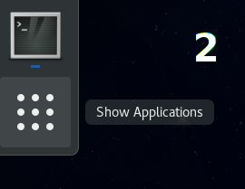
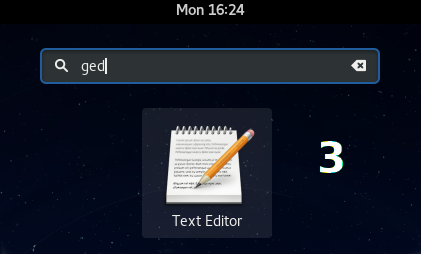

== First Steps in New System
=== Getting Oriented

You're now looking at the GNOME Shell environment. The key part of the interface is the upper left corner (_Activities_ button) which will get you to the overview with favorite apps, open windows etc. You don't have to click it, just move the mouse cursor to the upper left corner or press kbd:[Super] key. How to get to the full list of apps? On the left panel in the _Activities_ overview, you'll find an icon of grid of squares. Click it and you'll get a grid of all app launchers. The environment is very intuitive. You know the name of the app? Or just a couple of letters? Then you can just start typing (or use the search field on the top). Search is only not performed in applications, it also searches for contacts, files, settings etc.

.Initial screen of GNOME Shell
image::img/shell-a.png[width=500]

=== Let's go deeper

What's specific about working in _GNOME_? First of all notice that windows only have the close button. You'll understand why when we explain the _Activities_ overview. Minimalization doesn't make sense in the _GNOME_ desktop environment and you can maximize a window by dragging it to the top edge of the screen or by clicking the title bar. The goal of the environment is to stand in your way as least as possible which is why only the top panel is shown. We'll use the next picture to explain you the most important UI entities.

1. _Activities_ -- this button switches the desktop to the _Activities_ overview which is explained more in detail below. It's the starting point for most activities you do in the desktop system.

2. _Application Menu_ -- you'll find an application menu under the app icon. This menu is associated with the whole application (app settings, about etc.). Options that are related to individual windows of the app are in the windows themselves. Not every application has this menu. If it doesn't have it, you'll only find _Close_ button there.
+
.Application menu
image::img/menu-aplikace.png[width=300]

3. _Clock and calendar_ -- you'll find missed notifications and calendar under the date and time. If you use one of the apps that use the calendar backend of _GNOME_ (e.g. _Evolution_), you'll also see events you've previously saved in these apps.
+
.Clock and calendar
image::img/kalendar.png[width=500]
+
.User menu
image::img/menu.png[width=350]

4. _User Menu_ -- in the upper right corner there are the most important indicators (network connection, sound, battery etc.). If you click them you'll see a menu where you can adjust volume, set brightness, network connection, bluetooth and so on. The third part of the menu includes your name with an option to log out or switch accounts. On the bottom, you'll find three icons. The left icon opens the system settings, the middle icon locks the screen, and the right icon shows a restart/shutdown dialog.

=== What are the _Activities_ for? 

The _Activities_ overview is for launching apps, switching between them, switching between virtual desktops, desktop organization, and searching. In the middle of the screen there are opened windows that are there to switch between them. Because all opened windows are tiled in the _Activities_ overview there is no reason for window minimalization and as we already mentioned _GNOME_ doesn't have it. You can see other important parts of this overview on the picture below.

.Activities overview
image::img/shell-b.png[width=500]

1. _Dash_ -- Dash is panel (_menu_) where you can find running and favourite applications. Running applications are boldly underlined. If you want to add an application to favorite applications, click on it in Dash with right mouse button and select _Add to Favorites_
+
.Working with applications in Dash
image::img/dash-b.png[width=300]
+
.View of all applications

2. _Show applications_ -- again already mentioned function. This button will show launchers for all applications. You can switch between frequently used applications and all application in the bottom of the screen.

3. Search -- _GNOME_ provides very powerful search funcionality. You don't have to click to search field, you can start typing immidiatelly after opening _Activities_ mode and search function will be activated automatically. It is probably the fastest way to launch applications. Apart from them, you can search documents, pictures, virtual machines, not yet installed applications, contacts and so on. Or even do simple calculations. You can set what can be searched through actvities in System Settings under _Search_ field.

+
.Integrated search

4. _Virtual desktops_ -- we can see virtual desktops on the right side. YOu can have more than one virtual desktop even if you have just one physical monitor. You can use them to organize application windows in a better way. Number of virtual desktops in _GNOME_ is not fixed but dynamic - always as many as you have aapplications on plus one ready to be used. When you drag a window to virtual desktop, GNOME automatically creates another empty virtual desktop. It even automatically deletes empty virtual desktops. You can circle between virtual desktops directly in work mode with keyboard shortcut kbd:[Ctrl]+kbd:[Alt]+kbd[arrow ↑]/kbd[arrow ↓].

5. _Preview of open windows_ -- is used to get overview of all open windows and even for switching between them. Click on a window to switch to it. Or you can use keyboard to switch windows. Everything you have to do is to open _Activities_ and press kbd:[arrow ↓] and then use arrows to navigate between windows. Switching to window is done with kbd:[Enter] key.

=== Základní nastavení

_Uživatelská a systémová nastavení_ Fedory nalezneme tak, že stejně jako u{nbsp}dříve popsaného způsobu napíšeme slovo _nastavení_, nebo přes samopopisnou ikonu v{nbsp}menu na liště zcela vpravo nahoře. Nastavení jsou členěna do přehledných kategorií _Osobní_, _Hardware_ a _Systém_), kde je možné konfigurovat vše od uživatelských účtů, přes pozadí plochy, až po tiskárny. Naprostá většina běžné konfigurace bude probíhat právě zde. Aplikace umožňuje i propojení s{nbsp}množstvím online účtů, tedy s{nbsp}cloudovými službami, ať už používáte ownCloud, Google, Facebook a další. Takto přidaný účet umožní přístup k{nbsp}službám a datům daného poskytovatele a ostatním aplikacím. Používáte online chat? Potřebujete kontakty? Nic už není nutné zadávat znovu.

.Uživatelská a systémová nastavení
image::img/nastaveni.png[width=500]

.Správa software ve Fedoře
image::img/software.png[width=500]

=== Instalace nového softwaru

Fedora už v{nbsp}základu obsahuje mnoho potřebných aplikací (webový prohlížeč _Mozilla{nbsp}Firefox_, kancelářský balík _LibreOffice_, multimediální přehrávač _Totem_ a desítky dalších). Co když ale potřebujeme více programů? Ne všechen software může být zahrnut do výchozí instalace systému, je ale dostupný v{nbsp}tzv. repozitářích, z{nbsp}nichž lze daný program jednoduše stáhnout. Repozitář je tvořen sadou serverů a jejich zrcadel, kde jsou umístěny balíky s{nbsp}různými aplikacemi a knihovnami. Slyšeli jste o{nbsp}_appstore_ na různých mobilních platformách? Pak jste velice blízko, základní princip je stejný. Chcete nějaký program stáhnout z{nbsp}webu a nainstalovat? Zkuste se nejprve podívat, zda není k{nbsp}dispozici v{nbsp}repozitářích. Na Linuxu se tak instaluje naprostá většina aplikací. Jak tedy na to?

1. _Grafický správce_ -- aplikace _Software_ je přesně ten druh programu, který znáte z{nbsp}libovolné mobilní platformy. Je to elegantní a přehledná vstupní brána do repozitářů, kde lze dle názvu (nebo v{nbsp}rámci kategorie) vyhledávat celistvé aplikace a různé doplňky pro systém. Každá aplikace zde má svůj přehledný popis včetně licence a své velikosti. Stále platí: vše je opensource, vše je bezplatné. Přes nástroj _Software_ můžeme aplikace samozřejmě i odinstalovat a setkáme se s{nbsp}ním vždy, když budeme systém (a balíky v{nbsp}něm) aktualizovat.

2. _Nástroj DNF_ -- skrze nástroj _Software_ lze v{nbsp}repozitářích dohledat hlavně ucelené spustitelné aplikace. Není ale určen na dohledání jednotlivé (třeba vývojářské) knihovny, dokumentace nebo různých dílčích utilit. Ve Fedoře je přitom takřka dvacet tisíc balíků, zdaleka ne všechny však obsahují pouze aplikace. Pro přístup ke všem balíkům (a jejich vyhledávání, instalaci, apod.) můžeme použít nástroj _dnf_ (určený pro práci v{nbsp}shellu, není však těžké se jej naučit užívat) nebo jeho nadstavbu _Yum extender (DNF)_, která je opět grafická a dává nám veškerý uživatelský komfort.
\end{enumerate}

=== Kodeky a další software

Co když nějaký software k{nbsp}dispozici v{nbsp}repozitářích není? I{nbsp}taková situace může nastat. Často se jedná o{nbsp}specifický kodek nebo ovladač. Takový software nemusí být nezbytně placený, může být volně dostupný, ale už ho není (z{nbsp}licenčních, nebo patentových důvodů) možné zahrnout do Fedory. Tady nastupují repozitáře třetích stran, které nejsou spravované ani jinak spojené s{nbsp}Fedorou, ale mohou být velmi užitečné. (Dodejme, že za tyto zdroje softwaru nenese Fedora Project zodpovědnost a že nemusí mít vyřešenou právní nezávadnost podle autorského a patentového práva.)

1. _Firemní repozitáře_ -- korporace jako Google nebo Adobe nabízejí zdroje software obsahující jejich produkty. Jsou to různé vývojářské utility, ale i programy jako _Google Chrome_, _Adobe Flash plugin_ a další. Jak jednou z{nbsp}jejich webu nainstalujeme balík přidávající do našeho systému repozitář, vidíme dostupný software v{nbsp}nástrojích stejně tak jako dříve zmíněný _Software_ nebo _dnf_. Obdobným způsobem ho pak také spravujeme.

2. _Další repozitáře_ -- existují velké zdroje software třetích stran s{nbsp}množstvím balíků, ke kterým např. nemáme k{nbsp}dispozici zdrojové kódy nebo jsou jinak nevyhovující, ale které jsou stále užitečné. Multimediální kodeky a různé specifické ovladače pak můžeme nalézt v{nbsp}repozitářích jako je (asi nejznámější) _RPMFusion_. Instalace balíků pak opět probíhá analogicky.

3. _Copr repozitáře_ -- na rozdíl od předchozích dvou zmíněných variant jsou repozitáře Copr za všech okolností licenčně čisté. Je snadné je přidat a jsou, vedle oficiálních repozitářů, momentálně největší zdroj softwaru pro Fedoru. Může se jednat o{nbsp}nové verze desktopových prostředí, frameworků apod. Samozřejmě při práci s{nbsp}nimi je vždy nutné zjistit, co přesně daný software v{nbsp}systému způsobí. Naleznete je na adrese link:http://copr.fedoraproject.org[copr.fedoraproject.org].

